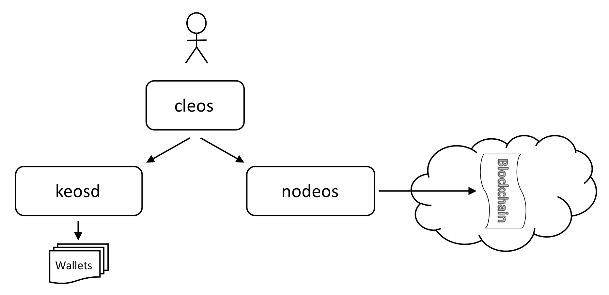

# Setting Up A Local Environment

## Overview

EOSIO由多个程序组成，下面是你会使用到的几个主要程序：

- nodeos - 服务器端区块链节点组件
- cleos - 用于与区块链交互、管理钱包的命令行界面
- keosd - 管理EOSIO钱包的组件

下图阐述了这三者之间的基本关系：



接下来我们将编译这些组件，并部署到一个单主机-单节点的测试网络（testnet）中。

## Getting The Code

从GIthub下载源代码

```sh
git clone https://github.com/EOSIO/eos --recursive
```

如果没有加--recursive的flag，可通过在仓库内运行以下命令加载submoduls

```sh
git submodule update --init --recursive
```

在整个EOSIO文档中，参考目录是你刚才clone EOSIO源码仓库的目录。假设我是clone在 ~ 目录下，那么\${EOSIO_SOURCE} = ~/eos，**注意：\${EOSIO_SOURCE}仅用于文档中助记使用，并没有对应的环境变量，也不要求存在该环境变量**。在文档中，更多的时候使用eos代替\${EOSIO_SOURCE} 。

## Building EOSIO

编译 EOSIO 最简单的方法是使用提供的脚本自动编译。如果需要手动编译，可以参照 https://github.com/EOSIO/eos/wiki/Local-Environment#manually-building-eosio Advanced Steps中的介绍。下面介绍自动编译。

编译位置在eos/build目录下，可执行文件编译后可以在eos/build/programs目录下找到。

### Automated build script

自动编译脚本可以安装依赖并且编译EOSIO，脚本支持以下操作系统：

1. Amazon 2017.09 and higher.
2. Centos 7.
3. Fedora 25 and higher (Fedora 27 recommended).
4. Mint 18.
5. Ubuntu 16.04 (Ubuntu 16.10 recommended).
6. MacOS Darwin 10.12 and higher (MacOS 10.13.x recommended).

### System Requirements (all platforms)

- 8GB RAM free required
- 20GB Disk free required

### Run the build script

在eos目录下执行以下命令：

```Sh
# cd eos
./eosio_build.sh
```

### Build validation

可以通过一组测试来执行一系列基本验证，在编译后进行测试，在验证之前先启动mongodb

- 在linux平台下运行以下命令：

```sh
~/opt/mongodb/bin/mongod -f ~/opt/mongodb/mongod.conf &
```

- 在MacOS下：

```sh
/usr/local/bin/mongod -f /usr/local/etc/mongod.conf &
```

然后：

```sh
cd eos/build
make test
```

### Install the executables

为了方便智能合约开发，可以将目标内容安装在<code>/usr/local</code>目录下，在<code>build</code>目录下使用<code>sudo make install</code>

```sh
cd eos/build
sudo make install
```

## Creating and Launching a Single Node Testnet

创建并启动一个单节点测试网络，在成功编译工程后，<code>nodes </code>二进制文件应该在<code>eos/build/programs/nodeos</code>目录下，进入该目录并执行以下命令：

```sh
cd eos/build/programs/nodeos
./nodeos -e -p eosio --plugin eosio::chain_api_plugin --plugin eosio::history_api_plugin 
```

如果你看到不断生成的log message，那么证明blocks已经成功生成。

此时，nodes正在与一个区块生产者eosio一起运行。

## Docker

在本地编译是一件很痛苦的事，大多数时候都会产生一系列不可预见的错误。

因此提供了基于Docker的EOSIO简单快速setup。

### Install Dependencies

- [Docker](https://docs.docker.com/) Docker 17.05 or higher is required
- [docker-compose](https://docs.docker.com/compose/) version >= 1.10.0

### Docker Requirement

- At least 7GB RAM (Docker -> Preferences -> Advanced -> Memory -> 7GB or above)
- If the build below fails, make sure you've adjusted Docker Memory settings and try again.

### Build eos image

```sh
git clone https://github.com/EOSIO/eos.git --recursive  --depth 1
cd eos/Docker
docker build . -t eosio/eos
```

如果你要指定一个版本进行build，例如，指定dawn-v4.0.0版本，根据此生成一个docker image，执行以下命令：

```sh
docker build -t eosio/eos:dawn-v4.0.0 --build-arg branch=dawn-v4.0.0 .
```

### Start nodeos docker container only

```
docker run --name nodeos -p 8888:8888 -p 9876:9876 -t eosio/eos nodeosd.sh arg1 arg2
```

默认情况下，所有的data都会保存在一个docker volume 内，如果测试网的数据过多或者损坏，可以通过以下命令删除：

```sh
$ docker inspect --format '{{ range .Mounts }}{{ .Name }} {{ end }}' nodeos
fdc265730a4f697346fa8b078c176e315b959e79365fc9cbd11f090ea0cb5cbc
$ docker volume rm fdc265730a4f697346fa8b078c176e315b959e79365fc9cbd11f090ea0cb5cbc
```

或者，你可以直接将主机目录挂载到容器中：

```sh
docker run --name nodeos -v /path-to-data-dir:/opt/eosio/bin/data-dir -p 8888:8888 -p 9876:9876 -t eosio/eos nodeosd.sh arg1 arg2
```

### Get chain info

```sh
curl http://127.0.0.1:8888/v1/chain/get_info
```

### Start both nodeos and keosd containers

```sh
docker volume create --name=nodeos-data-volume
docker volume create --name=keosd-data-volume
docker-compose up -d
```

在<code>docker-compose up -d</code>命令后，两个名为nodeos和keosd服务会启动，nodeos会对host暴露8888、9876端口，keosd不暴露任何端口，并且仅在cleos在keosd容器内运行时，才能被cleos访问。

### Execute cleos commands

```sh
alias cleos='docker-compose exec keosd /opt/eosio/bin/cleos -u http://nodeosd:8888 --wallet-url http://localhost:8888'
cleos get info
cleos get account inita
```

上传exchange样例合约：

```
cleos set contract exchange contracts/exchange/exchange.wast contracts/exchange/exchange.abi
```

如果不需要keosd，可以关闭该服务：

```
docker-compose stop keosd
```

更多与智能合约有关的操作可参照

https://github.com/EOSIO/eos/blob/master/Docker/README.md